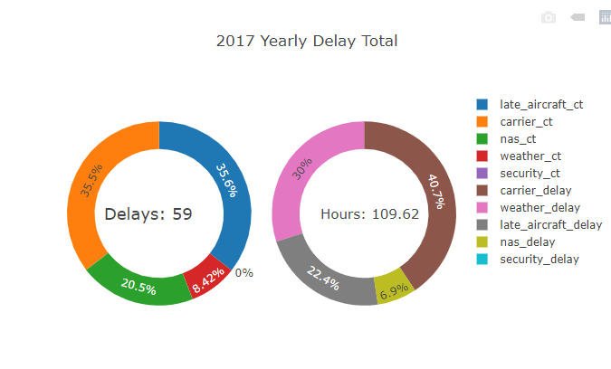

# Project2 AirlineDelays

Team members:

>**Jesus Jasso**

>**Brian Glaude**

For our project, we will be extracting 2 datasets from the Airline industry and weather. All datasets were explored from Kaggle and BTS. 

The primary objective for the following presentation is to manipulate data and transform it into a visulization that contains 3-4 graphics (i.e charts, maps, etc). The end goal is to find a relationship between daily weather events and airline travel delays that will make a much needed upcoming trip easier, post COVID. The detailed orientation will allow users to navigate through different Airlines displaying delays based on the type of weather along with selecting the top 10 airlines weather conditons for your convenience.

###Data Sources: 

https://www.kaggle.com/sobhanmoosavi/us-weather-events?select=US_WeatherEvents_2016-2019.csv

https://www.transtats.bts.gov/OT_Delay/ot_delaycause1.asp?pn=1&periodfrom=24245&periodto=24245

###Visualization Inspiration:

###Sketch:

